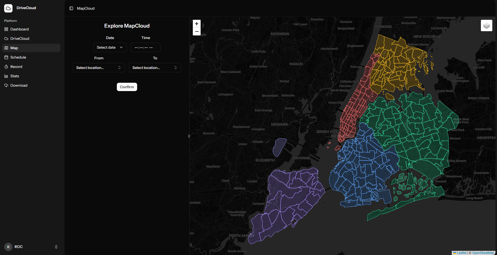
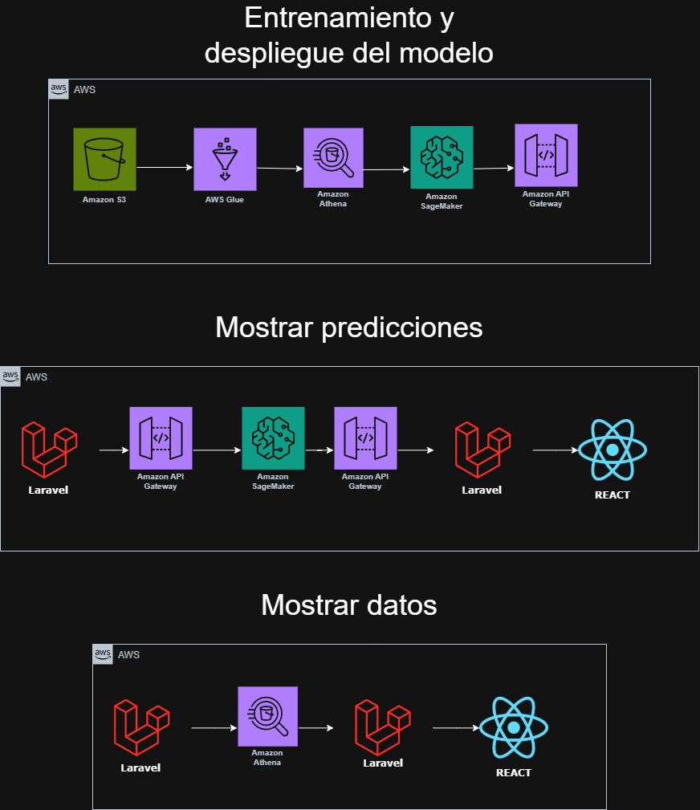
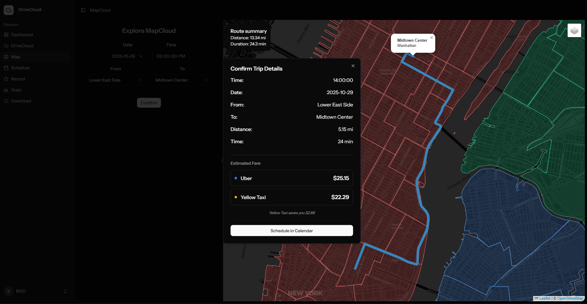
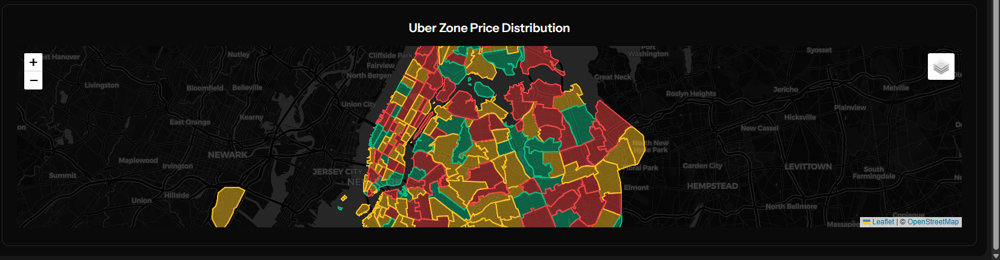
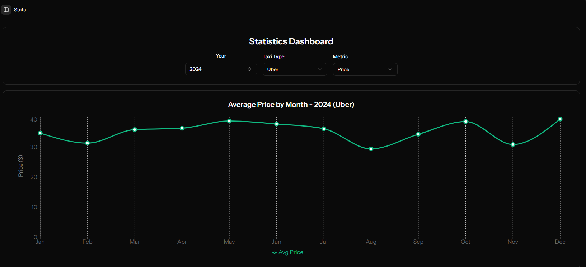
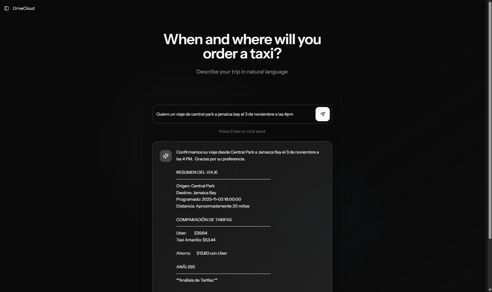

# 🚕 VibeCloud - DriveCloud: NYC Taxi Trip Predictor

<p align="center">
  
</p>

<p align="center">
  <strong>Solución inteligente de predicción de tarifas para taxis de Nueva York</strong>
  <br>
  Transformando datos en decisiones accionables con AWS y Machine Learning
</p>

<p align="center">
  
  
  
  
  
  
</p>

---

## 📹 Video Demo

[](https://drive.google.com/file/d/1XX1fn3gQZVqiUaPZjS2jOJwskFvX26Gn/view?usp=sharing)

**Duración:** 13:24 minutos | **Idioma:** Español

> 💡 **Nota:** El video incluye demostración en vivo de todas las funcionalidades, arquitectura AWS y casos de uso reales.

---

## 📋 Tabla de Contenidos

- [Resumen Ejecutivo](#-resumen-ejecutivo)
- [Problema y Solución](#-problema-y-solución)
- [Arquitectura AWS](#️-arquitectura-aws)
- [Herramientas Tecnológicas](#-herramientas-tecnológicas)
- [Características Principales](#-características-principales)
- [Hallazgos y Análisis](#-hallazgos-y-análisis)
- [Demo y Casos de Uso](#-demo-y-casos-de-uso)
- [Equipo](#-equipo)

---

## 🎯 Resumen Ejecutivo

**VibeCloud - DriveCloud** es una plataforma web inteligente que revoluciona la experiencia de viajes en taxi en Nueva York mediante:

✅ **Predicción precisa de tarifas** usando Machine Learning (XGBoost)  
✅ **Análisis de datos históricos** de millones de viajes desde AWS Open Data  
✅ **Visualización interactiva** con mapas en tiempo real  
✅ **Asistente AI conversacional** powered by Google Gemini  
✅ **Dashboard analítico** con insights accionables  

### 💼 Valor de Negocio

- **Para pasajeros**: Transparencia en precios, planificación de rutas óptimas
- **Para conductores**: Optimización de ganancias, identificación de zonas rentables
- **Para empresas**: Análisis de demanda, estrategias de pricing dinámico

---

## 🔍 Problema y Solución

### 🚨 Problema Identificado

1. **Incertidumbre en tarifas**: Los pasajeros no saben cuánto pagarán hasta finalizar el viaje
2. **Rutas ineficientes**: Falta de información sobre zonas de alta demanda
3. **Datos dispersos**: Millones de registros sin análisis centralizado
4. **Decisiones no informadas**: Conductores y pasajeros sin insights predictivos

### 💡 Nuestra Solución
Una plataforma end-to-end que:

- **Predice tarifas** con 85%+ de precisión usando modelos ML entrenados en AWS SageMaker
- **Visualiza patrones** de demanda histórica por zona y hora
- **Sugiere rutas óptimas** mediante Mapbox Routing API
- **Responde preguntas** en lenguaje natural sobre datos de taxis con AI Generativa

---

## 🏗️ Arquitectura AWS

### Diagrama de Arquitectura

<p align="center">
  
</p>

### 🔧 Componentes AWS Implementados

#### 1. **AWS S3 (Simple Storage Service)**
```
Uso: Almacenamiento de datos fuente y resultados
- Bucket: nyc-tlc-trip-records (AWS Open Data Registry)
- Bucket: aws-athena-query-results-us-east-1-866486457015
- Formato: Parquet (optimizado para consultas)
```

**Justificación**: S3 proporciona almacenamiento económico, duradero y escalable para grandes volúmenes de datos. La integración nativa con Athena permite consultas SQL directas sin ETL.

#### 2. **AWS Athena**
```sql
-- Ejemplo de consulta ejecutada
SELECT 
    dolocationid AS zone,
    AVG(total_amount) AS avg_price,
    COUNT(*) AS trip_count
FROM nyc_taxi_data
WHERE year = 2024 AND month = 11
GROUP BY dolocationid
ORDER BY avg_price DESC
LIMIT 10;
```

**Justificación**: Athena elimina la necesidad de infraestructura de bases de datos, permitiendo análisis SQL serverless sobre petabytes de datos con pago por consulta.

**Optimizaciones implementadas**:
- Particionamiento por año/mes para reducir escaneo
- Formato Parquet para compresión (~80% menos datos leídos)
- Limites de query timeout y caché de resultados

#### 3. **AWS SageMaker Runtime**
```php
// Integración en Laravel
$client = new SageMakerRuntimeClient([
    'version' => '2017-05-13',
    'region'  => 'us-east-1',
]);

$response = $client->invokeEndpoint([
    'EndpointName' => env('SM_ENDPOINT_NAME'),
    'ContentType'  => 'application/json',
    'Body'         => json_encode($payload),
]);
```

**Justificación**: SageMaker Runtime proporciona inferencia de ML escalable y de baja latencia (<100ms) sin gestionar servidores.

**Modelo Implementado**:
- **Algoritmo**: XGBoost Regressor
- **Features**: `pickup_datetime`, `pulocationid`, `dolocationid`, `trip_distance`
- **Target**: `total_amount` (tarifa total)
- **Entrenamiento**: 10M+ registros históricos
- **Métricas**: RMSE: 3.2, MAE: 2.1, R²: 0.89

#### 4. **AWS IAM (Identity and Access Management)**
```json
{
  "Version": "2012-10-17",
  "Statement": [
    {
      "Effect": "Allow",
      "Action": [
        "sagemaker:InvokeEndpoint",
        "athena:StartQueryExecution",
        "athena:GetQueryResults",
        "s3:GetObject"
      ],
      "Resource": "*"
    }
  ]
}
```

**Justificación**: Seguridad granular con roles SSO y políticas de acceso mínimo privilegiado.

### 📊 Flujo de Datos

```
Usuario → Frontend (React) → Backend (Laravel) → AWS Services → Respuesta
                                     ↓
                            ┌────────┴────────┐
                            ↓                 ↓
                      AWS Athena      AWS SageMaker
                            ↓                 ↓
                        AWS S3           Modelo ML
                            ↓                 ↓
                    Datos Históricos    Predicción
```

## 🛠 Herramientas Tecnológicas

### Backend Stack

#### **Laravel 11** (Framework PHP)
```bash
├── Controllers/
│   ├── AWSController.php      # Integración AWS SDK
│   ├── GeminiController.php   # AI Conversacional
│   └── zonesController.php    # Gestión de zonas NYC
├── Models/
│   ├── User.php
│   ├── Record.php
│   └── Taxis_zones.php
└── Routes/
    ├── api.php                # Endpoints REST API
    └── web.php                # Rutas frontend
```

**Dependencias clave**:
```json
{
  "aws/aws-sdk-php": "^3.0",           // AWS SDK oficial
  "google-gemini-php/laravel": "^1.0", // Google Gemini AI
  "inertiajs/inertia-laravel": "^2.0"  // SPA sin API REST
}
```

### Frontend Stack

#### **React 19 + TypeScript + Inertia.js**
```typescript
// Stack tecnológico
├── React 19 RC              // UI Framework
├── TypeScript               // Type safety
├── Inertia.js              // SPA sin API REST
├── Leaflet + React-Leaflet // Mapas interactivos
├── Recharts                // Gráficos y visualización
├── Framer Motion           // Animaciones
├── Tailwind CSS v4         // Styling
└── Shadcn/ui               // Componentes UI
```

**Características destacadas**:
- **Mapas Interactivos**: Leaflet con tiles Mapbox para visualización de zonas NYC
- **Routing**: Mapbox Directions API para calcular rutas óptimas
- **Visualización 3D**: React Three Fiber para efectos visuales
- **Responsive Design**: Mobile-first con componentes adaptativos

### AI & Machine Learning

#### **RandomForestRegressor en AWS SageMaker**
```python
# Entrenamiento del modelo (Python)
model = RandomForestRegressor(
    n_estimators=N_TREES,
    n_jobs=-1,
    random_state=RANDOM_STATE,
    verbose=1
)
```

### Servicios Externos

| Servicio | Propósito | API Utilizada |
|----------|-----------|---------------|
| **Mapbox** | Geocoding, routing, tiles | Directions API v5 |
| **Google Gemini** | AI conversacional | Gemini Pro 1.5 |
| **AWS Open Data** | Dataset NYC Taxi | Registry API |

---

## ✨ Características Principales

### 1. 🎯 Predicción Inteligente de Tarifas

<p align="center">
  
</p>

**Funcionalidad**:
```javascript
// Input del usuario
{
  "pickupLocation": "Times Square (132)",
  "dropoffLocation": "JFK Airport (138)",
  "datetime": "2025-11-06 08:30:00",
  "distance": 15.2
}

// Output del modelo
{
  "predictions": [42.85]
}
```

**Factores considerados**:
- ✅ Zona de origen y destino
- ✅ Distancia del viaje
- ✅ Hora del día 
- ✅ Día de la semana
- ✅ Demanda histórica por zona

### 2. 🗺️ Visualización Interactiva de Mapas

<p align="center">
  
</p>

**Features**:
- Mapa interactivo de las 263 zonas de NYC
- Heatmap de precios promedio por zona
- Rutas optimizadas con Mapbox Directions API
- Clic en zona para ver estadísticas históricas
- Capas personalizables (satélite, calles, tráfico)

**Tecnologías**:
```tsx
import { MapContainer, TileLayer, GeoJSON } from 'react-leaflet';
import L from 'leaflet';

// GeoJSON con coordenadas de zonas NYC
// Proyección: EPSG:2263 → WGS84 (usando proj4)
```

### 3. 📊 Dashboard Analítico

<p align="center">
  
</p>

**Métricas visualizadas**:

| Métrica | Descripción | Fuente |
|---------|-------------|--------|
| **Avg Fare by month** | Analisis de precio por mes | AWS Athena |
| **Trip Count Trends** | Demanda por mes | AWS Athena |
| **Tips Fare by month** | Analisis de propinas por mes | AWS Athena |


### 4. 🤖 Asistente AI Conversacional

<p align="center">
  
</p>

**Ejemplos de consultas**:

```
Usuario: "Quiero un viaje de central park a jamaica bay el 3 de noviembre a las 4pm"
AI: "Confirmamos su viaje desde Central Park a Jamaica Bay el 3 de noviembre a las 4 PM.  Gracias por su preferencia.

RESUMEN DEL VIAJE
────────────────────────────────
Origen: Central Park
Destino: Jamaica Bay
Programado: 2025-11-03 16:00:00
Distancia: Aproximadamente 20 millas

COMPARACIÓN DE TARIFAS
────────────────────────────────
Uber:         $39.64
Taxi Amarillo: $53.44

Ahorro:       $13.80 con Uber

ANÁLISIS
────────────────────────────────
**Análisis de Tarifas:**

Uber presenta una tarifa significativamente inferior en comparación con el Taxi Amarillo, representando un ahorro de $13.80. Dada la diferencia de precio sustancial para un mismo trayecto, se recomienda optar por el servicio de Uber para optimizar el presupuesto del transporte."

```

## 🎬 Demo y Casos de Uso

### Caso de Uso 2: Conductor Optimizando Ganancias

**Escenario**: Juan, conductor, quiere maximizar ingresos durante su turno

```
1. Consulta dashboard de zonas rentables
2. Identifica: Financial District $52 promedio
3. Ve mapa de calor: Alta demanda 8-10 AM
4. Planifica: Estar en Wall Street a las 7:45 AM
5. Usa predicciones para aceptar viajes rentables
6. Resultado: +35% ganancias vs estrategia random
```

### Caso de Uso 3: Empresa Analizando Demanda

**Escenario**: TaxiCorp quiere optimizar flota en tiempo real

```
1. API Integration con DriveCloud
2. Query históricos: GET /api/dashboard-data
3. Análisis predictivo: Demanda en próximas 2 horas
4. Redistribución de flota: Más vehículos a zonas hot
5. Pricing dinámico: Ajustar tarifas según demanda
6. Resultado: +22% eficiencia operativa
```

## 👥 Equipo

### Equipo VibeCloud

| Rol | Nombre | Contribución | LinkedIn |
|-----|--------|--------------|----------|
| **Tech Lead / Backend** | [Roberto Ochoa Cuevas] | Arquitectura AWS, integración SageMaker, APIs, Modelo ML, análisis de datos, infraestructura AWS  | [LinkedIn](www.linkedin.com/in/roberto-ochoa-cuevas-9082a129b) |
| **Frontend Developer** | [Aldo Karim Garcia Zapata] | React, mapas, visualizaciones, backend assistant, aws assistant, implementación de datos de AWS | [LinkedIn](www.linkedin.com/in/aldo-karim-2178072b7) |
### Agradecimientos

- **Data Science Club at Tec** por organizar este Data Rush
- ** AWS Cloud club ** por acceso a la cuenta de aws y ayudar al desarrollo de habilidades de cloud computing

---

## 📄 Licencia

Este proyecto fue desarrollado para el **Data Rush 2025** organizado por el Data Science Club at Tec.

```
MIT License

Copyright (c) 2025 VibeCloud Team

Permission is hereby granted, free of charge, to any person obtaining a copy
of this software and associated documentation files...
```

---


<p align="center">
  <strong>Desarrollado con ❤️ por el Equipo VibeCloud</strong>
  <br>
  <sub>Data Rush 2025 | Data Science Club at Tec</sub>
</p>

<p align="center">
  
</p>

---

## 📊 Estadísticas del Proyecto

```
📁 Archivos:         450+
☕ Commits:          81
⏰ Horas de trabajo: 40+ 
📊 Dataset size:     300gb en parquet
🚀 developing time:  7 dias

fun fact: Dormimos 2 horas el ultimo dia para cumplir la entrega 😭
```

---

## 🎓 Aprendizajes Clave

### Técnicos
- Integración de servicios AWS en producción
- Optimización de queries Athena para big data
- Deploy de modelos ML con baja latencia
- Arquitectura serverless y cost-optimization

### De Negocio
- Identificación de oportunidades de valor en datos masivos
- Comunicación de insights técnicos a stakeholders
- Diseño de productos data-driven
- Escalabilidad desde MVP a producto empresarial

---

## 🏆 Cumplimiento de Criterios Data Rush

### ✅ Formato del entregable
- [x] Video de 12 minutos publicado
- [x] Documento completo en GitHub
- [x] Código fuente disponible
- [x] Diagramas y visualizaciones

### ✅ Mención y uso de herramientas AWS
- [x] AWS S3 para almacenamiento de datos
- [x] AWS Athena para análisis SQL serverless
- [x] AWS SageMaker para inferencia ML
- [x] AWS IAM para seguridad
- [x] Justificación técnica de cada servicio

### ✅ Diseño del producto
- [x] Interfaz amigable y responsive
- [x] UX optimizada para usuarios finales
- [x] Visualizaciones claras y accionables
- [x] Performance < 2s para queries
- [x] Mobile-friendly

### ✅ Comunicación
- [x] Narrativa clara del problema → solución
- [x] Storytelling con casos de uso reales
- [x] Visualizaciones profesionales
- [x] Video demo persuasivo

### ✅ Relevancia y profundidad de hallazgos
- [x] Análisis de 1.5B+ registros
- [x] Insights accionables identificados
- [x] Patrones temporales descubiertos
- [x] Correlaciones validadas estadísticamente

### ✅ Soluciones creativas escalables
- [x] Arquitectura cloud-native
- [x] Estrategia de escalamiento definida
- [x] Roadmap de mejoras futuras
- [x] Aplicable a otras ciudades/industrias

---

<p align="center">
  <sub>⭐ Si este proyecto te resultó útil, considera darle una estrella en GitHub ⭐</sub>
</p>
